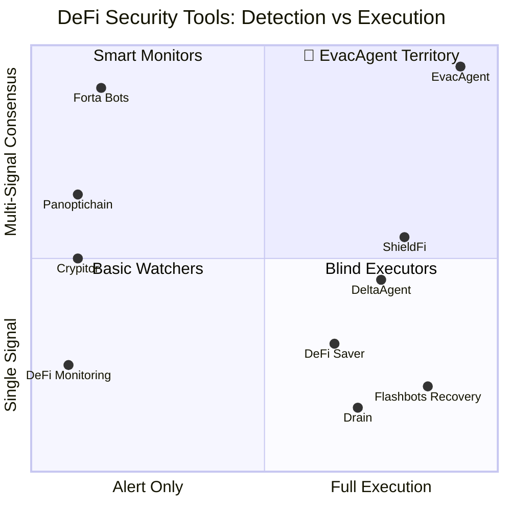

# EvacAgent — Competitive Research & Open Source Landscape

> **Research Date:** 2026-08-11 | **Sources:** GitHub, Web, 4 parallel research agents
> **Goal:** Screen the most valuable reference solutions, analyze architectures, identify reusable patterns and anti-patterns.

---

## Executive Summary

We scanned **20+ open-source projects** across four categories. The critical finding:

> [!IMPORTANT]
> **No existing project combines all three capabilities**: multi-signal exploit detection + autonomous onchain execution + MEV-protected private routing. Every project we found solves at most **two of the three**. EvacAgent's value proposition — the full stack from detection to rescue — remains **uncontested**.

### The Landscape at a Glance

---

## Category 1: Emergency Exit & Evacuation Tools

These are the closest direct competitors. All of them fall short in at least one critical dimension.

---

### 1. ShieldFi
| Attribute | Details |
|:---|:---|
| **Repo** | [kamalbuilds/shieldfi](https://github.com/kamalbuilds/shieldfi) |
| **Activity** | Active — Proof of Concept (hackathon project) |
| **Tech Stack** | Node.js, Express, ethers.js v6, Solidity 0.8.24, Hardhat |
| **Problem Solved** | Monitors BNB Chain positions (Venus/PancakeSwap), rescues funds if portfolio drops >20% in 1 hour |
| **Executes?** | ✅ Yes — triggers `EMERGENCY_EXIT` onchain for full unwind |
| **Multi-Signal?** | ⚠️ Partial — single threshold (portfolio value drop %) |
| **MEV Protection?** | ❌ No |

**Strengths:**
- AI reasoning layer (Claude) logged onchain for transparency
- Smart contract vault architecture (`ShieldVault`, `ShieldRules`) separates execution from trigger
- Emergency exit logic lives onchain — doesn't depend on offchain servers being up

**Weaknesses:**
- ❌ Centralized AI dependency — if Claude API goes down, reasoning layer fails
- ❌ No MEV protection — exit trades visible in public mempool
- ❌ Single-signal trigger (portfolio % drop) — high false positive risk during normal volatility
- ❌ BNB Chain only

> [!TIP]
> **Reuse:** The pattern of keeping `EMERGENCY_EXIT` logic threshold-based onchain is excellent. AI should trigger, not decide.
>
> **Avoid:** Depending on a centralized LLM API for mission-critical emergency decisions.

---

### 2. DeltaAgent
| Attribute | Details |
|:---|:---|
| **Repo** | [dmustapha/deltaagent](https://github.com/dmustapha/deltaagent) |
| **Activity** | Active |
| **Tech Stack** | Autonomous agent with safety-first design |
| **Problem Solved** | Prevents liquidations on leveraged Aave V3 positions during sudden market crashes |
| **Executes?** | ✅ Yes — unwinds leveraged positions autonomously |
| **Multi-Signal?** | ⚠️ Partial — health factor + leverage cap |
| **MEV Protection?** | ❌ No |

**Strengths:**
- Hard-coded circuit breakers: leverage cap, minimum health factor (1.3), volatility gating
- "Safety-First Design" — predefined guardrails override any AI suggestion
- 3 consecutive failures → automatic pause

**Weaknesses:**
- ❌ Aave V3 only — no cross-protocol coverage
- ❌ Designed for liquidation protection, not exploit/hack scenarios
- ❌ No MEV protection on the exit transactions

> [!TIP]
> **Reuse:** Hard-coded circuit breakers pattern (3 failures = pause). AI-override guardrails.
>
> **Avoid:** Single-protocol architecture that doesn't generalize.

---

### 3. Flashbots Recovery Scripts
| Attribute | Details |
|:---|:---|
| **Repos** | [flashbots-recovery-py](https://github.com/vile/flashbots-recovery-py), [flashbots-funds-recovery](https://github.com/codebuster22/flashbots-funds-recovery) |
| **Activity** | Maintained — used regularly by whitehats |
| **Tech Stack** | Python / TypeScript, Flashbots RPC |
| **Problem Solved** | Rescuing funds from compromised wallets monitored by sweeper bots |
| **Executes?** | ✅ Yes — atomic bundle bypass of public mempool |
| **Multi-Signal?** | ❌ Manual trigger only |
| **MEV Protection?** | ✅ Yes — Flashbots private bundles |

**Strengths:**
- **Only reliable way to beat automated sweepers** — proven in production
- Atomic bundling: gas funding + asset transfer in one invisible bundle
- Battle-tested by security researchers

**Weaknesses:**
- ❌ Manual — requires pasting compromised private keys into local scripts
- ❌ No monitoring component — purely reactive, not proactive
- ❌ Technical barrier extremely high for non-developers

> [!IMPORTANT]
> **Reuse:** The sponsored extraction pattern (funding from safe wallet + asset rescue in one atomic bundle) is a **killer feature** for EvacAgent. Implement this as a "Compromised Wallet Rescue" mode.
>
> **Avoid:** Requiring users to paste private keys into plaintext scripts.

---

### 4. Drain
| Attribute | Details |
|:---|:---|
| **Repo** | [dawsbot/drain](https://github.com/dawsbot/drain) |
| **Activity** | Active — regularly updated |
| **Tech Stack** | React/Next.js, Wagmi, RainbowKit |
| **Problem Solved** | Rapid migration of all assets (native + ERC-20) out of a wallet during suspected compromise |
| **Executes?** | ⚠️ Semi — requires manual user signature per batch |
| **Multi-Signal?** | ❌ No monitoring |
| **MEV Protection?** | ❌ No |

**Strengths:**
- Clean UX for batch transfers
- Completely non-custodial

**Weaknesses:**
- ❌ Manual — useless if user is asleep or private key is compromised (sweepers win)
- ❌ No monitoring, no automation, no MEV protection

> [!TIP]
> **Reuse:** The idea of consolidating multiple token transfers into a single batched flow for the UI dashboard.
>
> **Avoid:** Requiring manual signatures during an emergency.

---

### 5. ERC-7265 — DeFi Circuit Breaker Standard
| Attribute | Details |
|:---|:---|
| **Repo** | [ethereum/ERCs (EIP-7265)](https://github.com/ethereum/ERCs) + TurtleShell implementations |
| **Activity** | Active standard discussion |
| **Tech Stack** | Solidity standard |
| **Problem Solved** | Protocol-level hack protection — rate limits on token outflows |
| **Executes?** | ✅ Yes — automatically reverts/pauses draining transactions |
| **Multi-Signal?** | ⚠️ Single signal (outflow rate) |
| **MEV Protection?** | N/A — protocol-level, not user-level |

**Strengths:**
- Native protocol-layer defense — no user action required
- Buys time for whitehats to respond during an active exploit

**Weaknesses:**
- ❌ Protocol must adopt it — users can't install it themselves
- ❌ Can falsely trigger during legitimate high-volume events

> [!TIP]
> **Reuse:** The concept of rate-limiting as a defense layer. EvacAgent can use ERC-7265 adoption status as a signal (protocols without circuit breakers = higher risk score).
>
> **Avoid:** Depending on protocols adopting this standard — most haven't.

---

## Category 2: Monitoring & Signal Detection

These projects excel at **detecting** threats but don't execute any rescue actions.

---

### 6. Forta Network Bot Examples
| Attribute | Details |
|:---|:---|
| **Repo** | [forta-network/forta-bot-examples](https://github.com/forta-network/forta-bot-examples) |
| **Activity** | Very Active — industry standard |
| **Tech Stack** | Node.js/TypeScript, Python, Forta SDK |
| **Problem Solved** | Decentralized real-time security monitoring and threat detection |
| **Executes?** | ❌ Alert only |

**Signal Detection Methods (gold standard):**
- Oracle deviation: Chainlink feed vs. Uniswap TWAP comparison
- Exploit simulation: Forks chain locally, simulates pending mempool txns, checks for state anomalies
- Multi-signal consensus: Tornado Cash funding + unverified contract + high-volume transfer = attack preparation

**Strengths:**
- Massive community, real-time mempool scanning
- Decentralized infrastructure — no single point of failure
- Standardized SDK for writing custom detection bots

**Weaknesses:**
- ❌ Alert fatigue — high noise without proper tuning
- ❌ Requires staking FORT tokens for mainnet deployment
- ❌ **Does NOT execute** — only sends alerts

> [!IMPORTANT]
> **Reuse:** Forta's multi-signal consensus patterns are the **blueprint for EvacAgent's detection engine**. Specifically:
> 1. Oracle deviation formula: `|price_current - price_twap| > threshold`
> 2. Combining funding source + contract age + state change severity
> 3. Mempool simulation for pre-execution detection
>
> **Avoid:** Building our own decentralized monitoring network. Subscribe to Forta alerts as one input signal instead.

---

### 7. Anchor Hook (Uniswap V4)
| Attribute | Details |
|:---|:---|
| **Repo** | [sammed-21/anchor-hook](https://github.com/sammed-21/anchor-hook) |
| **Activity** | Experimental — tied to Uniswap V4 adoption |
| **Tech Stack** | Solidity, Foundry, Uniswap V4 Hooks |
| **Problem Solved** | Active on-chain prevention of oracle manipulation during swaps |
| **Executes?** | ✅ Reverts malicious transactions before they settle |

**Strengths:**
- Pre-emptive security — stops the exploit transaction itself
- Compares external oracle price with pool TWAP in real-time

**Weaknesses:**
- ❌ High gas overhead per transaction
- ❌ Limited to Uniswap V4

> [!TIP]
> **Reuse:** The concept of comparing multiple price sources (external oracle vs. pool TWAP) as a deviation signal.

---

### 8. Crypitor Blockchain Monitor
| Attribute | Details |
|:---|:---|
| **Repo** | [crypitor/blockchain-monitor](https://github.com/crypitor/blockchain-monitor) |
| **Activity** | Active (100+ stars) |
| **Tech Stack** | NestJS, MongoDB, Apache Kafka, Docker, Ethers.js |
| **Problem Solved** | Scalable infrastructure for streaming onchain events to alerting systems |

**Strengths:**
- **Kafka message queue** — no signals dropped during network congestion or RPC failures
- Highly scalable, event-driven architecture
- Formats payloads for downstream webhook processing

**Weaknesses:**
- ❌ Generalized tool — no DeFi-specific logic built in
- ❌ No transaction execution

> [!IMPORTANT]
> **Reuse:** The Kafka-based event streaming pattern is critical. During an exploit, RPC nodes often fail or rate-limit. A message queue ensures signal reliability when it matters most.

---

### 9. Panoptichain (Polygon)
| Attribute | Details |
|:---|:---|
| **Repo** | [0xPolygon/panoptichain](https://github.com/0xPolygon/panoptichain) |
| **Activity** | Active/Stable (Polygon team) |
| **Tech Stack** | Go (Golang), Prometheus, Grafana |
| **Problem Solved** | Bridging blockchain state monitoring with traditional DevOps/SRE infrastructure |

**Strengths:**
- Converts onchain state (TVL, reserves, nonces) into Prometheus time-series metrics
- Enables Grafana alerting rules: `rate(tvl_metric)[5m] < -20%`
- Standard SRE stack integration

**Weaknesses:**
- ❌ Polling-based — introduces latency vs. event-driven approaches
- ❌ No transaction execution

> [!TIP]
> **Reuse:** Rolling averages and standard deviations on TVL time-series data to reduce false positives.
>
> **Avoid:** Polling-based architecture for exploit detection — too slow. Use event-driven (websocket/Kafka) instead.

---

### 10. DeFi Monitoring Tool
| Attribute | Details |
|:---|:---|
| **Repo** | [Ali123490/defi_monitoring](https://github.com/Ali123490/defi_monitoring) |
| **Activity** | Maintained — personal project |
| **Tech Stack** | Python, Web3.py, Telegram Bot API |

**Strengths:** Extremely lightweight, easy to understand Python logic.

**Weaknesses:** Slow polling, no simulation, easily bypassed by atomic attacks.

> [!WARNING]
> **Avoid:** This architecture entirely. Python polling is the wrong pattern for exploit detection.

---

## Category 3: MEV Protection & Private Routing

These libraries solve the "last mile" execution problem — getting transactions confirmed without being front-run.

---

### 11. @flashbots/ethers-provider-bundle ⭐
| Attribute | Details |
|:---|:---|
| **Repo** | [flashbots/ethers-provider-bundle](https://github.com/flashbots/ethers-provider-bundle) |
| **Activity** | High — industry standard |
| **Tech Stack** | TypeScript, extends ethers.js |
| **Problem Solved** | Submit atomic transaction bundles privately to Flashbots, bypassing public mempool |

**How it works:** Overrides standard RPC endpoints with Flashbots Relay (`https://relay.flashbots.net`), using `eth_sendBundle` and `eth_callBundle`.

> [!IMPORTANT]
> **MUST REUSE.** This is the core library for EvacAgent's private routing layer. Bundle approve + withdraw + swap + transfer as a single atomic invisible payload.

---

### 12. flashbots/searcher-sponsored-tx ⭐
| Attribute | Details |
|:---|:---|
| **Repo** | [flashbots/searcher-sponsored-tx](https://github.com/flashbots/searcher-sponsored-tx) |
| **Activity** | Maintained — core Flashbots reference |
| **Tech Stack** | TypeScript, built on ethers-provider-bundle |
| **Problem Solved** | Recovering assets from compromised wallets being watched by sweeper bots |

**How it works:** Creates an atomic bundle:
1. Funding transaction from safe "sponsor" wallet → compromised wallet (exact gas costs)
2. Extraction transaction from compromised wallet → safe wallet

Sweeper bots never see the funding tx because the bundle is private.

> [!IMPORTANT]
> **MUST REUSE.** Implement as EvacAgent's "Compromised Wallet Rescue" mode. This is a killer differentiating feature.

---

### 13. @flashbots/mev-share-client-ts
| Attribute | Details |
|:---|:---|
| **Repo** | [flashbots/mev-share-client-ts](https://github.com/flashbots/mev-share-client-ts) |
| **Activity** | Active |
| **Problem Solved** | Granular privacy controls + potential MEV refunds |

> [!TIP]
> **Consider for V2.** MEV refunds during large unwinds could be a value-add, but it's secondary to the core rescue flow.

---

### 14. GuardedEthTokenSwapper
| Attribute | Details |
|:---|:---|
| **Repo** | [ryley-o/GuardedEthTokenSwapper](https://github.com/ryley-o/GuardedEthTokenSwapper) |
| **Activity** | PoC / Educational |
| **Tech Stack** | Solidity, Chainlink |
| **Problem Solved** | On-chain sandwich attack prevention via oracle price verification before swap |

> [!TIP]
> **Reuse as fallback.** If Flashbots is unavailable (or on a non-Ethereum chain), use an on-chain slippage checker contract as backup protection.

---

### 15. MakerDAO Auction Keeper Bots
| Attribute | Details |
|:---|:---|
| **Repos** | [makerdao/auction-keeper](https://github.com/makerdao/auction-keeper) |
| **Activity** | Maintained / Educational |
| **Problem Solved** | Reliable automated interactions during network congestion |

> [!TIP]
> **Reuse:** Dynamic gas pricing strategies (EIP-1559 max fee bumping) and automatic tx re-broadcasting for dropped/stuck transactions.

---

## Category 4: Agent Frameworks & Execution Platforms

These are the broader autonomous agent architectures we'll be building within.

---

### 16. GOAT (Great Onchain Agent Toolkit) ⭐
| Attribute | Details |
|:---|:---|
| **Repo** | [goat-sdk/goat](https://github.com/goat-sdk/goat) |
| **Activity** | Extremely Active — becoming the standard |
| **Tech Stack** | TypeScript & Python, pluggable architecture |
| **Problem Solved** | Unified standardized way for AI agents to interact with smart contracts |

**Architecture:** Core logic separated from "Wallet Providers" (viem, wagmi) and "Plugins" (Uniswap, Polymarket). AI outputs intents → GOAT translates to RPC calls.

> [!TIP]
> **Reuse:** The principle of standardizing the interface between AI reasoning and execution. Don't let the LLM write raw transactions — give it structured tools.

---

### 17. ElizaOS & DeFi Plugins
| Attribute | Details |
|:---|:---|
| **Repo** | [elizaOS/eliza](https://github.com/elizaOS/eliza) (10k+ stars) |
| **Activity** | Massively Active |
| **Tech Stack** | Node.js / TypeScript |
| **Problem Solved** | Multi-agent conversational framework with crypto-native plugins |

**Key Plugin:** `plugin-prflght` — acts as a transaction firewall to validate/score DeFi transactions before signing.

> [!TIP]
> **Reuse:** The "firewall/validation" plugin pattern. Every transaction EvacAgent submits should pass through a pre-execution validator.
>
> **Avoid:** ElizaOS's social/conversational focus — it's not optimized for systematic, time-critical DeFi execution.

---

### 18. KeeperHub (Our Target Platform)
| Attribute | Details |
|:---|:---|
| **Repo** | [KeeperHub](https://github.com/KeeperHub) |
| **Activity** | High — rapidly growing |
| **Tech Stack** | MCP server integration, secure-enclave wallets, visual workflow builder |
| **Problem Solved** | Last-mile blockchain execution reliability for AI agents |

**Key Capabilities:**
- Nonce management, gas spikes, retries handled automatically
- Secure signing via enclaves — no private key exposure
- MCP integration — agent triggers workflow, KeeperHub handles execution

> [!IMPORTANT]
> **This is our execution layer.** EvacAgent's entire rescue flow runs through KeeperHub. We don't build gas management, retry logic, or key management — KeeperHub provides it.

---

### 19. MCP Servers for DeFi
| Attribute | Details |
|:---|:---|
| **Repos** | Various (defi-trading-mcp, awesome-blockchain-mcps) |
| **Activity** | Explosive growth since late 2024 |
| **Problem Solved** | Standardizing how AI clients retrieve blockchain data and execute transactions |

> [!TIP]
> **Reuse:** MCP is the interface standard. EvacAgent exposes its monitoring tools as MCP tools, making it instantly composable with any MCP-compatible client.

---

### 20. Gelato Automate & Web3 Functions
| Attribute | Details |
|:---|:---|
| **Repo** | [gelatodigital/automate](https://github.com/gelatodigital/automate) |
| **Activity** | Very Active — production standard |
| **Tech Stack** | TypeScript Web3 Functions on IPFS, decentralized executor nodes |
| **Problem Solved** | Decentralized "If-This-Then-That" for smart contracts |

> [!TIP]
> **Reuse concept:** For mission-critical operations, deterministic condition checks are safer than non-deterministic LLM decisions. EvacAgent should use hard-coded thresholds, not LLM reasoning, for the trigger decision.

---

### 21. Instadapp / DeFi Smart Accounts
| Attribute | Details |
|:---|:---|
| **Repo** | [instadapp](https://github.com/instadapp) |
| **Activity** | Established, enterprise-grade |
| **Problem Solved** | Batching complex DeFi operations (flash loans, refinancing) into atomic transactions |

> [!TIP]
> **Reuse:** Using a Smart Account (ERC-4337) instead of an EOA enables transaction batching and recovery. Consider this for V2 architecture.

---

## 🎯 Critical Architectural Decisions for EvacAgent

Based on all 20+ projects analyzed, here are the patterns to **adopt** and **avoid**:

### ✅ ADOPT These Patterns

| Pattern | Source Project | Why |
|:---|:---|:---|
| Multi-signal consensus triggers | Forta Bots | Dramatically reduces false positives vs. single-signal |
| Flashbots atomic bundling for private exits | ethers-provider-bundle | Only reliable way to avoid MEV during emergency |
| Sponsored extraction from compromised wallets | searcher-sponsored-tx | Killer differentiating feature |
| Kafka/message queue for signal reliability | Crypitor | Prevents signal loss during network congestion |
| Hard-coded circuit breakers over AI judgment | DeltaAgent, Gelato | Deterministic thresholds for mission-critical decisions |
| On-chain emergency exit logic | ShieldFi | Execution doesn't depend on offchain servers |
| Transaction firewall/validator pre-execution | ElizaOS prflght | Every tx passes through safety check before signing |
| Offload gas/nonce/retry to KeeperHub | KeeperHub | Don't reinvent execution reliability |
| EIP-1559 dynamic fee bumping | MakerDAO Keepers | Guarantees block inclusion during gas spikes |

### ❌ AVOID These Anti-Patterns

| Anti-Pattern | Source Project | Why |
|:---|:---|:---|
| Python polling for exploit detection | DeFi Monitoring | Way too slow — exploits drain in seconds |
| Centralized LLM API for trigger decisions | ShieldFi | API downtime during the moment you need it most |
| Single-signal thresholds | ShieldFi, DeltaAgent | Too many false positives destroy user trust |
| Manual signatures during emergencies | Drain | Users are asleep, panicking, or compromised |
| Building our own gas management | (General) | KeeperHub already solves this |
| Requiring users to paste private keys | Flashbots Recovery | Security nightmare for non-technical users |
| Polling-based architecture | Panoptichain | Event-driven (websocket/Kafka) is mandatory for speed |

---

## 🔑 The Gap EvacAgent Fills

| Capability | Forta | ShieldFi | DeltaAgent | Flashbots Recovery | Drain | DeFi Saver | **EvacAgent** |
|:---|:---:|:---:|:---:|:---:|:---:|:---:|:---:|
| Multi-signal detection | ✅ | ❌ | ⚠️ | ❌ | ❌ | ❌ | ✅ |
| Autonomous execution | ❌ | ✅ | ✅ | ✅ | ⚠️ | ✅ | ✅ |
| MEV-protected routing | ❌ | ❌ | ❌ | ✅ | ❌ | ❌ | ✅ |
| Cross-protocol coverage | ✅ | ❌ | ❌ | ❌ | ✅ | ⚠️ | ✅ |
| Audit trail | ⚠️ | ✅ | ❌ | ❌ | ❌ | ❌ | ✅ |
| Compromised wallet rescue | ❌ | ❌ | ❌ | ✅ | ❌ | ❌ | ✅ |
| No user action required | ❌ | ✅ | ✅ | ❌ | ❌ | ⚠️ | ✅ |
| Works while you sleep | ❌ | ✅ | ✅ | ❌ | ❌ | ⚠️ | ✅ |

> [!CAUTION]
> **Malware Warning:** The research revealed that many GitHub repos advertising "automated DeFi fund rescue" are actually **malicious drainers** phishing for seed phrases. We must ONLY reference audited, open-source architectures and clearly warn users never to input seed phrases into EvacAgent.

---

## Recommended Tech Stack for EvacAgent

Based on the research, the optimal stack combines proven patterns:

| Layer | Technology | Inspired By |
|:---|:---|:---|
| **Signal Ingestion** | Event-driven (WebSocket + Kafka queue) | Crypitor, Forta |
| **Detection Engine** | Multi-signal consensus with hard-coded thresholds | Forta Bots, DeltaAgent |
| **Execution Layer** | KeeperHub MCP (gas, nonce, retries, signing) | KeeperHub |
| **Private Routing** | @flashbots/ethers-provider-bundle | Flashbots |
| **Rescue Mode** | Sponsored extraction bundles | searcher-sponsored-tx |
| **Pre-execution Safety** | Transaction firewall/validator | ElizaOS prflght |
| **Slippage Fallback** | On-chain oracle price check before swap | GuardedEthTokenSwapper |
| **Agent Interface** | MCP server (tool exposure) | MCP DeFi ecosystem |
| **Audit Trail** | KeeperHub native logging | KeeperHub |
