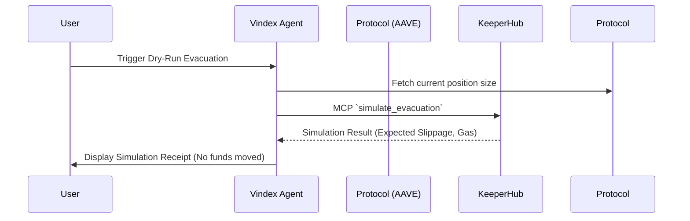
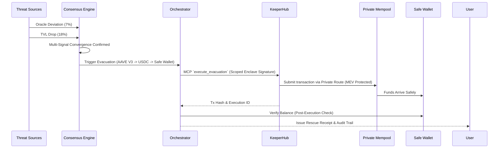

# System Architecture and Database Schema

## 1. 7-Layer Architecture Deep Dive

Vindex operates on a strict seven-layer model to ensure reliability and strict isolation of concerns. A threat detection is not a rescue, and a rescue is not complete until the destination balance is verified.

1. **Signal Ingestion Layer**
   - **Responsibility:** Normalizes source events from on-chain activity, price oracles, pending transactions, security feeds, and governance changes.
   - **Output:** Standardized threat data.

2. **Signal Processing Layer**
   - **Responsibility:** Filters noise and deduplicates events.
   - **Output:** Scored, verified signals.

3. **Consensus Engine Layer**
   - **Responsibility:** Determines if signals are converging into a unified threat. Requires independent confirmation to prevent false evacuations.
   - **Output:** Threat level assessment and decision record.

4. **Pre-Execution Validator Layer**
   - **Responsibility:** Validates whether the exit path can work safely by simulating the exit transaction.
   - **Output:** Supported path, slippage calculation, and simulation result.

5. **Execution Orchestrator Layer**
   - **Responsibility:** Prepares the exact payload needed for the rescue.
   - **Output:** Ordered exit payload.

6. **KeeperHub Execution Layer**
   - **Responsibility:** Submits the transaction securely using KeeperHub’s gas management, nonce handling, private routing, and retries.
   - **Output:** Execution ID, status, and transaction hash.

7. **Post-Execution Verification Layer**
   - **Responsibility:** Confirms the success of the rescue by checking the safe wallet.
   - **Output:** Balance verification and complete audit receipt.

---

## 2. Technology Stack

Vindex leverages a modern, highly performant stack built for speed and strict type safety:

- **Frontend & Routing:** Next.js 16 (App Router)
- **UI & Components:** React 19, TailwindCSS v4
- **Language:** TypeScript (Strict Mode)
- **Web3 Interaction:** Viem / Ethers.js v6
- **Database & Persistence:** Drizzle ORM + PostgreSQL/SQLite (persists monitored positions, threat signals, execution logs, audit receipts)
- **Execution Engine:** KeeperHub MCP SDK / API

---

## 3. Database Schema

Vindex uses Drizzle ORM to define strict typing for PostgreSQL. This structure guarantees a complete audit trail of every position, threat, and execution.

```typescript
import { pgTable, text, timestamp, integer, boolean, jsonb, uuid } from "drizzle-orm/pg-core";

export const positions = pgTable("positions", {
  id: uuid("id").primaryKey().defaultRandom(),
  userId: text("user_id").notNull(),
  protocol: text("protocol").notNull(), // e.g. "AAVE_V3"
  chainId: integer("chain_id").notNull(),
  asset: text("asset").notNull(),
  amount: text("amount").notNull(),
  safeWallet: text("safe_wallet").notNull(),
  status: text("status").notNull().default("active"),
  createdAt: timestamp("created_at").defaultNow(),
});

export const monitors = pgTable("monitors", {
  id: uuid("id").primaryKey().defaultRandom(),
  positionId: uuid("position_id").references(() => positions.id),
  thresholdType: text("threshold_type").notNull(),
  thresholdValue: jsonb("threshold_value").notNull(),
  isActive: boolean("is_active").default(true),
});

export const threatSignals = pgTable("threat_signals", {
  id: uuid("id").primaryKey().defaultRandom(),
  positionId: uuid("position_id").references(() => positions.id),
  source: text("source").notNull(), // e.g., "ORACLE", "MEMPOOL"
  signalType: text("signal_type").notNull(),
  severity: text("severity").notNull(),
  details: jsonb("details"),
  timestamp: timestamp("timestamp").defaultNow(),
});

export const evacuations = pgTable("evacuations", {
  id: uuid("id").primaryKey().defaultRandom(),
  positionId: uuid("position_id").references(() => positions.id),
  status: text("status").notNull(), // "simulating", "simulated", "executing", "completed", "failed"
  txHash: text("tx_hash"),
  keeperhubExecutionId: text("keeperhub_execution_id"),
  gasUsed: text("gas_used"),
  amountRescued: text("amount_rescued"),
  destination: text("destination"),
  startedAt: timestamp("started_at").defaultNow(),
  completedAt: timestamp("completed_at"),
});

export const auditLogs = pgTable("audit_logs", {
  id: uuid("id").primaryKey().defaultRandom(),
  evacuationId: uuid("evacuation_id").references(() => evacuations.id),
  action: text("action").notNull(),
  details: jsonb("details"),
  timestamp: timestamp("timestamp").defaultNow(),
});
```

---

## 4. KeeperHub Integration Architecture

Vindex delegates the most critical, high-risk components of transaction execution to KeeperHub.

### A. MCP Server Tool Schema
Vindex integrates with KeeperHub via an MCP (Model Context Protocol) Server. This exposes native tools to the Vindex agent:
- `simulate_evacuation`: Runs a dry-run of the withdrawal, swap, and transfer.
- `execute_evacuation`: Submits the confirmed transaction payload to the KeeperHub network.
- `verify_safe_wallet`: Reads the destination balance post-execution.

### B. Secure Enclave Key Delegation
Vindex is non-custodial and never holds private keys in plain text. Users grant signing authority to a KeeperHub Secure Enclave specifically scoped to allow execution *only* to the pre-configured safe wallet.

### C. Private Bundle Routing
To protect escaping funds from MEV bots (sandwich attacks, front-running), KeeperHub routes the Vindex evacuation transactions via private RPC endpoints (e.g., Flashbots, MEV Blocker). The transaction remains invisible in the public mempool until it is included in a block.

### D. Gas Estimation Override
During an exploit, network congestion spikes. KeeperHub automatically overrides standard gas estimates, applying aggressive priority fees to guarantee block inclusion within seconds, preventing the evacuation from stalling.

### E. Pay-Per-Check (x402/MPP) Billing Structure
Vindex uses a micropayment billing architecture. Instead of flat subscriptions, monitoring heartbeats are billed using the L402 (formerly 402) protocol for machine-to-machine payments. Each signal check costs fractions of a cent, unlocking the API request seamlessly.

---

## 5. Execution Flows

### Simulation Flow (Dry-Run)



### Real Evacuation Flow (Confirmed Threat)


